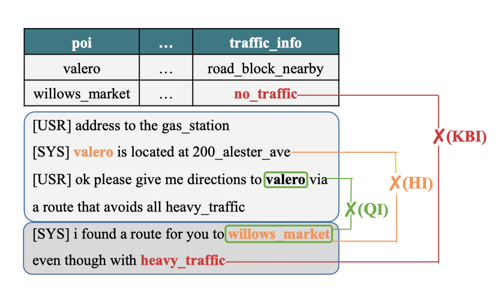
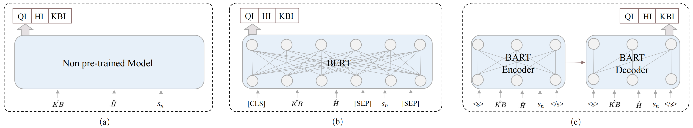

# Don’t be Contradicted with Anything!CI-ToD: Towards Benchmarking Consistency for Task-oriented Dialogue System

 [](https://opensource.org/licenses/MIT) 

This repository contains the PyTorch implementation and the data of the paper: **Don’t be Contradicted with Anything!CI-ToD: Towards Benchmarking Consistency for Task-oriented Dialogue System**. **[Libo Qin](https://scholar.google.com/citations?user=8lVpK1QAAAAJ)**, [Tianbao Xie](https://scholar.google.com/citations?user=8sdGK_0AAAAJ), [Shijue Huang](https://github.com/JoeYing1019), [Qiguang Chen](https://github.com/LightChen233), [Xiao Xu](https://scholar.google.com/citations?user=lgVN8tcAAAAJ), [Wanxiang Che](https://scholar.google.com/citations?user=SVlQ6IEAAAAJ).  ***EMNLP2021***.[[PDF]](https://arxiv.org/pdf/2109.11292.pdf) .


This code has been written using PyTorch >= 1.1. If you use any source codes or the datasets included in this toolkit in your work, please cite the following paper. The bibtex are listed below:

<pre>
@misc{qin2021dont,
      title={Don't be Contradicted with Anything! CI-ToD: Towards Benchmarking Consistency for Task-oriented Dialogue System}, 
      author={Libo Qin and Tianbao Xie and Shijue Huang and Qiguang Chen and Xiao Xu and Wanxiang Che},
      year={2021},
      eprint={2109.11292},
      archivePrefix={arXiv},
      primaryClass={cs.CL}
}
</pre>


## Abstract

Consistency Identification has obtained remarkable success on open-domain dialogue, which can be used for preventing inconsistent response generation. However, in contrast to the rapid development in open-domain dialogue, few efforts have been made to the task-oriented dialogue direction. In this paper, we argue that *consistency problem* is more urgent in task-oriented domain. To facilitate the research, we introduce CI-ToD, a novel dataset for **Consistency Identification in Task-oriented Dialog system**. In addition, we not only annotate the single label to enable the  model to judge whether the system response  is contradictory, but also provide **more finegrained labels** (i.e., **Dialogue History Inconsistency(HI), User Query Inconsistency(QI) and Knowledge Base Inconsistency(KBI)**, which are as shown in the figure below) to encourage model to know what inconsistent sources lead to it. Empirical results show that state-of-the-art methods only achieve performance of 51.3%, which is far behind the human performance of 93.2%, indicating that **there is ample room for improving consistency identification ability**. Finally,  we conduct exhaustive experiments and qualitative analysis to comprehend key challenges and provide guidance for future directions.




##  Dataset

We construct the CI-ToD dataset based on the  KVRET dataset. We release our dataset together with the code, you can find it under `data`.

The basic format of the dataset is as follows, including multiple rounds of dialogue, knowledge base and related inconsistency annotations (KBI, QI, HI)：

```
[
    {
        "id": 74,
        "dialogue": [
            {
                "turn": "driver",
                "utterance": "i need to find out the date and time for my swimming_activity"
            },
            {
                "turn": "assistant",
                "utterance": "i have two which one i have one for the_14th at 6pm and one for the_12th at 7pm"
            }
        ],
        "scenario": {
            "kb": {
                "items": [
                    {
                        "date": "the_11th",
                        "time": "9am",
                        "event": "tennis_activity",
                        "agenda": "-",
                        "room": "-",
                        "party": "father"
                    },
                    {
                        "date": "the_18th",
                        "time": "2pm",
                        "event": "football_activity",
                        "agenda": "-",
                        "room": "-",
                        "party": "martha"
                    },
                    .......
                ]
            },
            "qi": "0",
            "hi": "0",
            "kbi": "0"
        },
        "HIPosition": []
    }
```

### KBRetriever_DC

<table>
	<tr>
	    <th>Dataset</th>
	    <th>QI</th>
        <th>HI</th>
        <th>KBI</th>
        <th>SUM</th>
	</tr>
	<tr>
	    <td>calendar_train.json</td>
	    <td>174</td>
	    <td>56</td>
        <td>177</td>
        <td>595</td>
	</tr>
	<tr>
	    <td>calendar_dev.json</td>
	    <td>28</td>
	    <td>9</td>
        <td>24</td>
        <td>74</td>
	</tr>
    <tr>
	    <td>calendar_test.json</td>
	    <td>23</td>
	    <td>8</td>
        <td>21</td>
        <td>74</td>
	</tr>
    <tr>
	    <td>navigate_train.json</td>
	    <td>453</td>
	    <td>386</td>
        <td>591</td>
        <td>1110</td>
	</tr>
	<tr>
	    <td>navigate_dev.json</td>
	    <td>55</td>
	    <td>41</td>
        <td>69</td>
        <td>139</td>
	</tr>
    <tr>
	    <td>navigate_test.json</td>
	    <td>48</td>
	    <td>44</td>
        <td>71</td>
        <td>138</td>
	</tr>
    <tr>
	    <td>weather_new_train.json</td>
	    <td>631</td>
	    <td>132</td>
        <td>551</td>
        <td>848</td>
	</tr>
	<tr>
	    <td>weather_new_dev.json</td>
	    <td>81</td>
	    <td>14</td>
        <td>66</td>
        <td>106</td>
	</tr>
    <tr>
	    <td>weather_new_test.json</td>
	    <td>72</td>
	    <td>12</td>
        <td>69</td>
        <td>106</td>
	</tr>
</table>


## Model



Here is the model structure of non pre-trained model (a) and pre-trained model (b and c). 

## Preparation

we provide some pre-trained baselines on our proposed CI-TOD dataset, the  packages we used are listed follow:

```
-- scikit-learn==0.23.2
-- numpy=1.19.1
-- pytorch=1.1.0
-- fitlog==0.9.13
-- tqdm=4.49.0
-- sklearn==0.0
-- transformers==3.2.0
```

We highly suggest you using [Anaconda](https://www.anaconda.com/) to manage your python environment. If so, you can run the following command directly on the terminal to create the environment:

```
conda env create -f py3.6pytorch1.1_.yaml
```

## How to run it

The script **train.py** acts as a main function to the project, you can run the experiments by the following commands:

```
python -u train.py --cfg KBRetriver_DC/KBRetriver_DC_BERT.cfg
```

The parameters we use are configured in the `configure`. If you need to adjust them, you can modify them in the relevant files or append parameters to the command.

Finally, you can check the results in `logs` folder.Also,  you can run fitlog command to visualize the results:

```
fitlog log logs/
```

## Baseline Experiment Result

All experiments were performed in TITAN_XP except for BART, which was performed on Tesla V100 PCIE 32 GB. These may not be the best results. Therefore, the parameters can be adjusted to obtain better results.

### KBRetriever_DC

<table>
	<tr>
	    <th>Baseline category</th>
	    <th> Baseline method </th>
	    <th>QI F1</th>
        <th>HI F1</th>
        <th>KBI F1</th>
        <th>Overall Acc</th>
	</tr >
	<tr >
	    <td rowspan="3">Non Pre-trained Model</td>
        <td>ESIM (Chen et al., 2017)</td>
	    <td>0.512</td>
	    <td>0.164</td>
        <td>0.543</td>
        <td>0.432</td>
	</tr>
	<tr>
	    <td>Infersent (Romanov and Shivade, 2018)</td>
	    <td>0.557</td>
	    <td>0.031</td>
        <td>0.336</td>
        <td>0.356</td>
	</tr>
	<tr>
	    <td>RE2 (Yang et al., 2019)</td>
	    <td>0.655</td>
	    <td>0.244</td>
        <td>0.739</td>
        <td>0.481</td>
	</tr>
	<tr>
	    <td rowspan="5">Pre-trained Model</td>
        <td>BERT (Devlin et al., 2019)</td>
	    <td>0.691</td>
        <td><b>0.555</b></td>
        <td>0.740</td>
        <td>0.500</td>
	</tr>
	<tr>
        <td>RoBERTa (Liu et al., 2019)</td>
	    <td>0.715</td>
        <td>0.472</td>
        <td>0.715</td>
        <td>0.500</td>
	</tr>
	<tr>
	    <td>XLNet (Yang et al., 2020)</td>
	    <td>0.725</td>
        <td>0.487</td>
        <td>0.736</td>
        <td>0.509</td>
	</tr>
	<tr>
	    <td>Longformer (Beltagy et al., 2020)</td>
	    <td>0.717</td>
        <td>0.500</td>
        <td>0.710</td>
        <td>0.497</td>
	</tr>
	<tr>
	    <td>BART (Lewis et al., 2020)</td>
	    <td><b>0.744</b></td>
        <td>0.510</td>
        <td><b>0.761</b></td>
        <td><b>0.513</b></td>
	</tr>
	<tr>
	    <td>Human</td>
        <td>Human Performance</td>
	    <td>0.962</td>
        <td>0.805</td>
        <td>0.920</td>
        <td>0.932</td>
	</tr>
</table>

## Leaderboard

If you submit papers with these datasets, please consider sending a pull request to merge your results onto the leaderboard. By submitting, you acknowledge that your results are obtained purely by training on the training datasets and tuned on the dev datasets (e.g. you only evaluted on the test set once). 

### KBRetriever_DC

<table>
	<tr>
	    <th> Baseline method </th>
	    <th>QI F1</th>
        <th>HI F1</th>
        <th>KBI F1</th>
        <th>Overall Acc</th>
	</tr >
	<tr >
        <td>ESIM (Chen et al., 2017)</td>
	    <td>0.512</td>
	    <td>0.164</td>
        <td>0.543</td>
        <td>0.432</td>
	</tr>
	<tr>
	    <td>Infersent (Romanov and Shivade, 2018)</td>
	    <td>0.557</td>
	    <td>0.031</td>
        <td>0.336</td>
        <td>0.356</td>
	</tr>
	<tr>
	    <td>RE2 (Yang et al., 2019)</td>
	    <td>0.655</td>
	    <td>0.244</td>
        <td>0.739</td>
        <td>0.481</td>
	</tr>
	<tr>
        <td>BERT (Devlin et al., 2019)</td>
	    <td>0.691</td>
        <td><b>0.555</b></td>
        <td>0.740</td>
        <td>0.500</td>
	</tr>
	<tr>
        <td>RoBERTa (Liu et al., 2019)</td>
	    <td>0.715</td>
        <td>0.472</td>
        <td>0.715</td>
        <td>0.500</td>
	</tr>
	<tr>
	    <td>XLNet (Yang et al., 2020)</td>
	    <td>0.725</td>
        <td>0.487</td>
        <td>0.736</td>
        <td>0.509</td>
	</tr>
	<tr>
	    <td>Longformer (Beltagy et al., 2020)</td>
	    <td>0.717</td>
        <td>0.500</td>
        <td>0.710</td>
        <td>0.497</td>
	</tr>
	<tr>
	    <td>BART (Lewis et al., 2020)</td>
	    <td><b>0.744</b></td>
        <td>0.510</td>
        <td><b>0.761</b></td>
        <td><b>0.513</b></td>
	</tr>
	<tr>
        <td>Human Performance</td>
	    <td>0.962</td>
        <td>0.805</td>
        <td>0.920</td>
        <td>0.932</td>
	</tr>
</table>

## Acknowledgement

Thanks for patient annotation from all taggers Lehan Wang, Ran Duan, Fuxuan Wei, Yudi Zhang, Weiyun Wang!

Thanks for supports and guidance from our adviser [Wanxiang Che](http://ir.hit.edu.cn/~car/)! 

## Contact us

- Just feel free to open issues or send us email([me](mailto:lbqin@ir.hit.edu.cn), [Tianbao](mailto:tianbaoxie@ir.hit.edu.cn)) if you have any problems or find some mistakes in this dataset.

